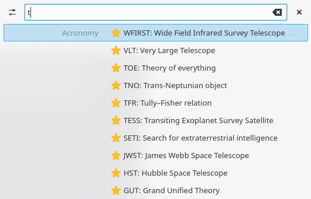

## Acronomy Krunner plugin

This plugin allows to quickly look up an acronym on [Acronomy](https://acronomy.lw1.at/) directly from the Krunner KDE plasma search.

For installation instructions check 

No search queries are sent to the Acronomy server. Instead a list of all acronyms is fetched and searched locally.

This plugin uses the [Astroacro API](https://acronomy.lw1.at/api/). ([Privacy Policy](http://lw1.at/i))

--------------------

based on [Krunner Python Plugin](https://store.kde.org/p/1333634/) by Alexander Lohnau licenced under  GPLv2 or later 
and the runner6python template at https://invent.kde.org/frameworks/krunner/-/tree/master/templates/runner6python
